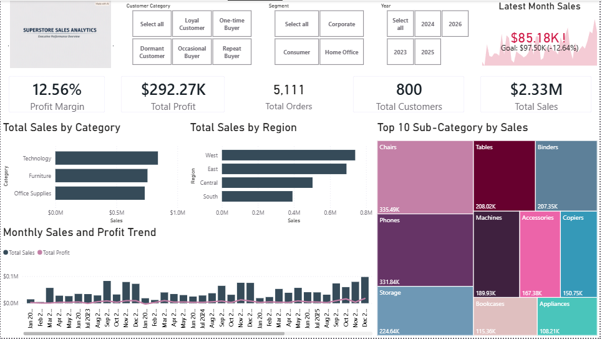
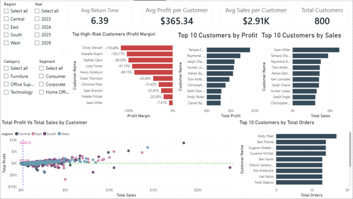
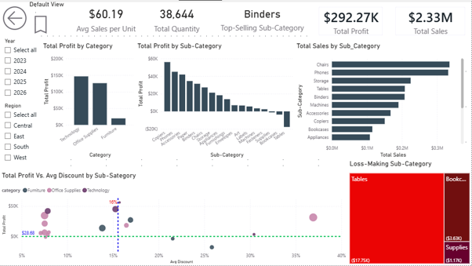
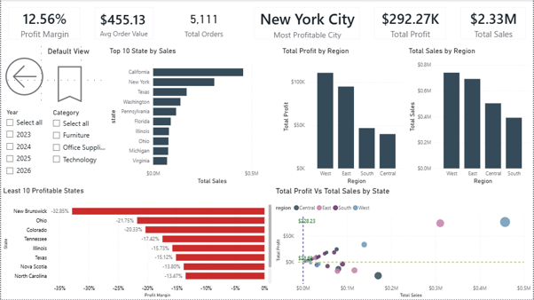
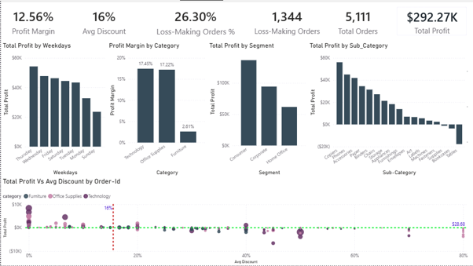

# Superstore Sales & Profitability Analysis

## Project Overview

An end-to-end data analytics project examining sales, profitability, customers, products, regional performance, and discounting using Python and Power BI.

The project combines data cleaning, exploratory data analysis, statistical analysis, and interactive business intelligence reporting to identify factors influencing profitability and provide data-driven business recommendations.

---

## Business Objective

The objective of this project was to understand:

* Overall sales and profitability performance
* Customer and order behavior
* Product and sub-category performance
* Regional differences in business performance
* Loss-making products and sub-categories
* The relationship between discounting and profitability
* Factors associated with changes in profit

The analysis was designed to move beyond revenue reporting and evaluate whether sales were translating into sustainable profitability.

---

## Dataset & Data Preparation

The original dataset contained **10,194 records**.

During data cleaning, **2 duplicate rows** were identified and removed, resulting in a final analytical dataset of **10,192 records**.

Python and Pandas were used for data cleaning and feature engineering before the cleaned dataset was loaded into Power BI.

Key transformations included date-related features, shipping calculations, customer categorization, weekday information, first-purchase analysis, and quantity-discount analysis.

---

## Tools & Technologies

* Python
* Pandas
* NumPy
* Matplotlib
* Seaborn
* Power BI
* DAX
* Statsmodels
* Statistical Analysis
* OLS Regression

---

## Analytical Approach

### Python Analysis

The Python analysis covered:

* Data inspection and cleaning
* Duplicate detection and removal
* Feature engineering
* Exploratory data analysis
* Descriptive statistics
* Customer analysis
* Product and sub-category analysis
* Regional analysis
* Discount analysis
* Correlation analysis
* OLS regression
* Key findings
* Business conclusions and recommendations

### Power BI Analysis

The cleaned dataset was loaded into Power BI to create an interactive five-page dashboard:

1. **Executive Overview** — overall business performance and KPI monitoring
2. **Customer Analysis** — customer-level sales, profit and order performance
3. **Product Analysis** — product and sub-category performance
4. **Regional Analysis** — comparison of Central, East, South and West regions
5. **Profitability & Discount Analysis** — profitability, discounting and loss-making sub-categories

The report uses DAX measures, interactive filtering and drillthrough functionality to support deeper analysis.

---

## Key Business Metrics

| Metric          |        Result |
| --------------- | ------------: |
| Total Sales     | $2,326,153.86 |
| Total Profit    |   $292,273.46 |
| Profit Margin   |        12.56% |
| Distinct Orders |         5,111 |
| Quantity Sold   |        38,644 |
| Sub-Categories  |            17 |

---

## Key Findings

### Sales do not always translate into profitability

Technology and Office Supplies are major contributors to sales and profitability, but strong revenue does not always result in strong profit. Furniture contains sub-categories where substantial sales are accompanied by low or negative profitability.

### Profitability varies across regions

The West and East are strong contributors to overall sales and profit, while the South performs comparatively weaker in overall business contribution. Regression analysis also indicates statistically significant regional differences after controlling for other variables.

### Customer segments differ in profitability efficiency

Consumer is the largest segment by sales, profit, quantity and order volume. Corporate generates substantial revenue with a higher profit margin than Consumer, while Home Office contributes less absolute revenue and profit but records the highest profit margin.

### Discounting is a major profitability concern

Higher discount levels are strongly associated with lower profitability. The regression analysis identifies discount as one of the strongest negative and statistically significant predictors of profit.

### Sales volume alone is not a reliable performance measure

Higher quantities do not necessarily result in higher profits. Quantity showed a statistically significant negative association with profit after controlling for sales, discount, product sub-category and region.

### Product mix is a major differentiator

Profitability varies substantially across sub-categories. Binders and Copiers show positive associations with profit, while several sub-categories—including Bookcases, Chairs, Machines, Storage, Supplies and Tables—show negative associations relative to the regression reference category.

### High-margin products provide important opportunities

Binders and Copiers demonstrate strong profitability characteristics. Copiers generated the highest sub-category profit despite recording the lowest quantity sold, demonstrating that sales volume alone does not determine profitability.

### Discounting can amplify weaknesses in low-margin products

The combination of descriptive analysis and regression results indicates that aggressive discounting can further weaken already low-margin product lines.

---

## Key Business Conclusions

The central business challenge identified in this analysis is **not simply generating sales, but converting sales into sustainable profit**.

The analysis demonstrates that revenue growth can be undermined by excessive discounting, low-margin product lines, and inefficient sales volume. Product mix, customer segments and regional factors also contribute to differences in profitability.

The findings support a shift from **revenue-focused growth to profit-focused growth**, where sales performance is evaluated alongside profit, margin, discount levels and product-level profitability.

---

## Business Recommendations

### 1. Optimize Discounting Strategy

Limit excessive discounts, particularly on low-margin and loss-making product lines. Replace broad discounting with targeted promotions based on product profitability, customer behavior and demand.

### 2. Protect and Expand High-Margin Products

Prioritize profitable opportunities such as Binders and Copiers while continuing to invest in strong categories such as Technology and Office Supplies.

### 3. Reassess Low-Margin Product Lines

Review structurally weak sub-categories such as Tables, Machines, Bookcases, Chairs, Storage and Supplies by evaluating pricing, discount levels, product costs and demand.

### 4. Improve Shipping & Fulfillment Efficiency

Review shipping costs by product characteristics, shipping mode, region and order type. Explore carrier negotiations and order consolidation where practical.

### 5. Develop Region-Specific Strategies

Use regional performance differences to develop targeted strategies rather than applying a uniform approach across all markets.

### 6. Tailor Customer Segment Strategies

Continue prioritizing the Consumer segment because of its scale while developing targeted strategies for Corporate and identifying opportunities to grow Home Office without sacrificing its relatively strong margin.

### 7. Implement Data-Driven Pricing & Promotion

Use sales, discount, product, customer and profitability data to develop more disciplined pricing and promotional decisions.

### 8. Monitor Profitability Alongside Revenue Growth

Performance monitoring should combine sales, profit, profit margin, discount rate, order volume and loss-making orders.

---

## Statistical Analysis

Correlation analysis was used to examine relationships between key numerical variables.

OLS regression was subsequently used to investigate the relationship between profit and selected business variables.

The model produced an **R² of 0.337**, meaning approximately 33.7% of the variation in profit was explained by the variables included in the model.

The analysis identified:

* A positive association between sales and profit
* A strong negative association between discount and profit
* A statistically significant relationship between quantity and profit
* Significant profitability differences across several sub-categories
* Significant regional effects

The regression findings were interpreted as statistical associations and not as evidence of causation.

---

## Portfolio Evidence

This repository contains the Python analysis and supporting visual evidence from the Power BI dashboard.

The project demonstrates an end-to-end analytical workflow:

**Data Cleaning → Feature Engineering → Exploratory Data Analysis → Statistical Analysis → Regression → Power BI → Business Insights → Recommendations**

## Power BI Dashboard

### Executive Overview



### Customer Analysis



### Product Analysis



### Regional Analysis



### Profitability & Discount Analysis


---
## Project Files

* **Python Analysis Notebook** — [View the complete Python analysis](notebooks/superstore_sales_profitability_analysis.ipynb)
* **Power BI Dashboard** — [View the Power BI report](superstore_sales_profitability_analysis.pbix)
* **Dashboard Screenshots** — [View all dashboard pages](dashboards/)

## Analytical Workflow

**Original Dataset → Data Cleaning → Exploratory Data Analysis → Statistical Analysis → OLS Regression → Cleaned Dataset → Power BI Data Modelling → DAX Measures → Interactive Dashboard → Business Insights & Recommendations**


## Project Structure

```text
superstore-sales-profitability-analysis/
│
├── README.md
│
├── notebooks/
│   └── superstore_analysis.ipynb
│
├── dashboards/
│   ├── executive_overview.png
│   ├── customer_analysis.png
│   ├── product_analysis.png
│   ├── regional_analysis.png
│   └── profitability_discount_analysis.png
│
└── data/
    └── README.md
```

---

## Author

**Quadri Akanbi Olahassan**

**Petroleum Engineer | Data Analytics | Transitioning into Machine Learning**
